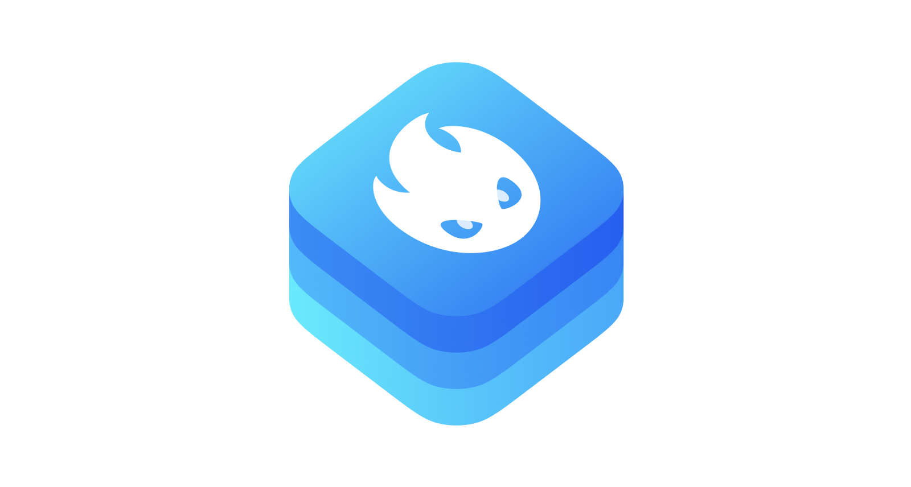

<div align = "center">
  <a href="https://cocoapods.org/pods/SwiftyDAO">
    
  </a>
  <a href="https://github.com/incetro/DAO">
    
  </a>
  <a href="https://github.com/incetro/DAO#installation">
    
  </a>
</div>

<div align = "center">
  <a href="https://travis-ci.org/incetro/DAO">
    
  </a>
  <a href="https://cocoapods.org/pods/SwiftyDAO" target="blank">
    
  </a>
  <a href="https://cocoapods.org/pods/NIO" target="blank">
    
  </a>
  <br>
  <br>
</div>

An implementation of [DAO pattern](http://www.oracle.com/technetwork/java/dataaccessobject-138824.html) for CoreData and Realm.
Now you can think less about database in your applications.

- [Features](#features)
- [Supported frameworks](#supported-frameworks)
- [Usage](#usage)
- [How it works](#how-it-works)
- [Requirements](#requirements)
- [Communication](#communication)
- [Installation](#installation)
- [Author](#author)
- [License](#license)

## Features
- [x] CRUD operations for your database based on [Monreau](https://github.com/incetro/Monreau)
- [x] Abstraction of database objects (models) from application objects (plains)

## Supported frameworks
- [x] CoreData
- [x] Realm

## Usage

```swift
import Monreau
import DAO

/// Create DAO instance
let dao = DAO(
    storage: RealmStorage<UserModelObject>,
    translator: UsersTranslator()
)

// Obtain messages (from backend for example)
let messages = messagesService.obtainMessages()

/// Save messages 
try dao.persist(messages)

/// Obtain some info from database
let count = try dao.read().count

/// Erase all messages from database
try dao.erase()
```

## How it works

1. Create some database model class

```swift
// MARK: - DialogModelObject

final class DialogModelObject: RealmModel {

    // MARK: - Properties

    /// True if the dialog has been pinned
    @objc dynamic var isPinned = false

    /// All available (stored) the dialog's messages
    let messages = List<MessageModelObject>()
}

// MARK: - MessageModelObject

final class MessageModelObject: RealmModel {

    /// Sending date
    @objc dynamic var date = Date()

    /// Message text
    @objc dynamic var text = ""

    /// Receiver's id
    @objc dynamic var receiverId = 0

    /// Sender's id
    @objc dynamic var senderId = 0

    /// Message type
    @objc dynamic var type = 0

    /// True if the message is incoming
    @objc dynamic var isIncoming = false

    /// True if the message has been read
    @objc dynamic var isRead = false
}
```

2. Create plain object class/struct


```swift
import DAO
import Foundation

// MARK: - MessagePlainObject

struct MessagePlainObject: Plain {

    // MARK: - Plain

    var uniqueId: UniqueID {
        return UniqueID(value: id)
    }
    
    // MARK: - Properties

    /// Unique identifier
    let id: Int

    /// Sending date
    let date: Date

    /// Message text
    let text: String

    /// Sender's id
    let senderId: Int

    /// Receiver's id
    let receiverId: Int

    /// Message type
    let type: Int

    /// True if the message is incoming
    let isIncoming: Bool

    /// True if the message has been read
    let isRead: Bool
}

// MARK: - DialogPlainObject

struct DialogPlainObject: Plain {

    // MARK: - Plain

    var uniqueId: UniqueID {
        return UniqueID(value: id)
    }
    
    // MARK: - Properties

    /// Unique id
    let id: Int

    /// True if the dialog has been pinned
    let isPinned: Bool

    /// All available (stored) the dialog's messages
    let messages: [MessagePlainObject]
}

```

3. Create Translator class


```swift
// MARK: - MessageTranslator

final class MessageTranslator {

    // MARK: - Aliases

    typealias PlainModel = MessagePlainObject
    typealias DatabaseModel = MessageModelObject
}

// MARK: - Translator

extension MessageTranslator: Translator {

    func translate(model: DatabaseModel) throws -> PlainModel {
        MessagePlainObject(
            id: Int(model.uniqueId) ?? 0,
            date: model.date,
            text: model.text,
            senderId: model.senderId,
            receiverId: model.receiverId,
            type: model.type,
            isIncoming: model.isIncoming,
            isRead: model.isRead
        )
    }
    
    func translate(plain: PlainModel) throws -> DatabaseModel {
        let model = MessageModelObject()
        try translate(from: plain, to: model)
        return model
    }

    func translate(from plain: PlainModel, to databaseModel: DatabaseModel) throws {
        if databaseModel.uniqueId.isEmpty {
            databaseModel.uniqueId = plain.uniqueId.rawValue
        }
        databaseModel.date = plain.date
        databaseModel.isIncoming = plain.isIncoming
        databaseModel.isRead = plain.isRead
        databaseModel.senderId = plain.senderId
        databaseModel.text = plain.text
        databaseModel.type = plain.type
        databaseModel.receiverId = plain.receiverId
    }
}

// MARK: - DialogTranslator

final class DialogTranslator {

    // MARK: - Aliases

    typealias PlainModel = DialogPlainObject
    typealias DatabaseModel = DialogModelObject
}

// MARK: - Translator

extension DialogTranslator: Translator {

    func translate(model: DatabaseModel) throws -> PlainModel {
        DialogPlainObject(
            id: Int(model.uniqueId) ?? 0,
            isPinned: model.isPinned,
            messages: try MessagesTranslator().translate(
                models: Array(model.messages)
            )
        )
    }

    func translate(plain: PlainModel) throws -> DatabaseModel {
        let model = DialogModelObject()
        try translate(from: plain, to: model)
        return model
    }
    
    func translate(from plain: PlainModel, to databaseModel: DatabaseModel) throws {
        if databaseModel.uniqueId.isEmpty {
            databaseModel.uniqueId = plain.uniqueId.rawValue
        }
        databaseModel.isPinned = plain.isPinned
        databaseModel.messages.removeAll()
        databaseModel.messages.append(
            objectsIn: try MessagesTranslator().translate(
                plains: plain.messages
            )
        )
    }
}
```
4. Use it

```swift
let dao = DAO(
    storage: RealmStorage<DialogModelObject>,
    translator: DialogTranslator()
)

// Obtain messages (from backend for example)
let dialogs = dialogsService.obtainDialogs()

...

/// Obtain messages from your database
let dialogs = try dao.read()
```
	
## Requirements
- iOS 10.0+ / macOS 10.12+ / tvOS 10.0+ / watchOS 3.0+
- Xcode 9.0
- Swift 5

## Communication

- If you **found a bug**, open an issue.
- If you **have a feature request**, open an issue.
- If you **want to contribute**, submit a pull request.

## Installation

### CocoaPods

[CocoaPods](http://cocoapods.org) is a dependency manager for Cocoa projects. You can install it with the following command:

```bash
$ gem install cocoapods
```

To integrate DAO into your Xcode project using CocoaPods, specify it in your `Podfile`:

```ruby
use_frameworks!

target "<Your Target Name>" do
    pod "SwiftyDAO"
end
```

Then, run the following command:

```bash
$ pod install
```

### Manually

If you prefer not to use any dependency managers, you can integrate DAO into your project manually.

#### Embedded Framework

- Open up Terminal, `cd` into your top-level project directory, and run the following command "if" your project is not initialized as a git repository:

  ```bash
  $ git init
  ```

- Add DAO as a git [submodule](http://git-scm.com/docs/git-submodule) by running the following command:

  ```bash
  $ git submodule add https://github.com/incetro/DAO.git
  ```

- Open the new `DAO` folder, and drag the `DAO.xcodeproj` into the Project Navigator of your application's Xcode project.

    > It should appear nested underneath your application's blue project icon. Whether it is above or below all the other Xcode groups does not matter.

- Select the `DAO.xcodeproj` in the Project Navigator and verify the deployment target matches that of your application target.
- Next, select your application project in the Project Navigator (blue project icon) to navigate to the target configuration window and select the application target under the "Targets" heading in the sidebar.
- In the tab bar at the top of that window, open the "General" panel.
- Click on the `+` button under the "Embedded Binaries" section.
- You will see two different `DAO.xcodeproj` folders each with two different versions of the `DAO.framework` nested inside a `Products` folder.

    > It does not matter which `Products` folder you choose from, but it does matter whether you choose the top or bottom `DAO.framework`.

- Select the top `DAO.framework` for iOS and the bottom one for OS X.

    > You can verify which one you selected by inspecting the build log for your project. The build target for `Nio` will be listed as either `DAO iOS`, `DAO macOS`, `DAO tvOS` or `DAO watchOS`.

- And that's it!

  > The `DAO.framework` is automagically added as a target dependency, linked framework and embedded framework in a copy files build phase which is all you need to build on the simulator and a device.
  
## Author

incetro, incetro@ya.ru

## License

DAO is available under the MIT license. See the LICENSE file for more info.
